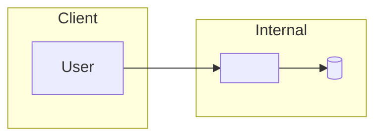

# Threat Model — <Feature Name>

- **Feature:** <one-line description of what the feature does>
- **Templates applied:** <e.g. STRIDE, OWASP, AWS>
- **Date / version:** <YYYY-MM-DD / v1>
- **Author / reviewer:** <name(s)>

## 1. Model & Trust Boundaries

| ID | Boundary | Between | Why it matters |
|----|----------|---------|----------------|
| TB1 |  |  |  |

## 2. Threat List

| ID | Threat | Template | Default severity | Affected component(s) / boundary |
|----|--------|----------|------------------|----------------------------------|
|  |  |  |  |  |

## 3. Control Mapping & Evaluation

| Threat ID | Suggested control(s) | Implementation status | Severity | Threat status | Rationale |
|-----------|----------------------|-----------------------|----------|---------------|-----------|
|  |  | Implemented / Partial / Not / Unknown |  | Mitigated / Accepted / Open |  |

## 4. Security Backlog

| Priority | Threat ref | Affected components | Proposed mitigation | Suggested owner |
|----------|-----------|---------------------|---------------------|-----------------|
|  |  |  |  |  |

## 5. Summary

<Short paragraph: what was modeled; threat counts by status; top open risks and first actions; any threats outside the template (template-maintenance candidates); any pending human decisions (accept calls, risk-appetite weighting).>
