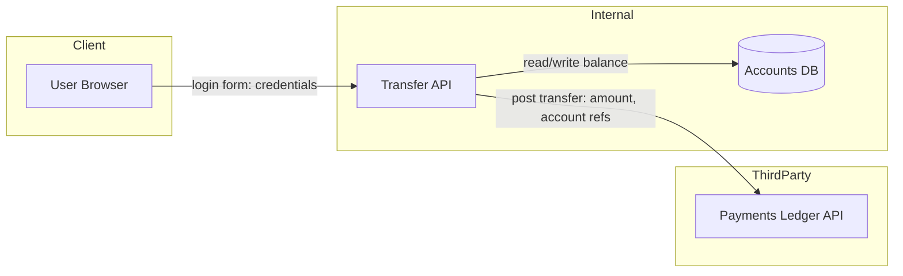

# RaD-TM Deliverable Format

This is the exact structure for the threat-model document. The deliverables map 1:1 to the six stages. Keep it concise — RaD-TM output should be skimmable, not a report nobody reads.

## Document structure

```
# Threat Model — <Feature Name>

- **Feature:** one-line description
- **Templates applied:** e.g. PCI DSS v4, Secure-Code (OWASP), AWS
- **Date / version:** 
- **Author / reviewer:** 

## 1. Model & Trust Boundaries        (Stages 1–2)
## 2. Threat List                     (Stage 3)
## 3. Control Mapping & Evaluation     (Stages 4–5)
## 4. Security Backlog                 (Stage 6)
## 5. Summary
```

## 1. Model & Trust Boundaries

A Mermaid `flowchart` plus a list of trust boundaries.

**Diagram conventions:**
- Nodes are components; edges are interactions labelled with the data that flows (mark sensitive data, e.g. `creds`, `JWT`, `PAN`, `PII`).
- Use `subgraph` blocks to show trust zones (e.g. `Client`, `Internal`, `Third-party`).
- Keep it to the feature scope.



**Trust boundaries** — list each one and the nodes it sits between:

| ID | Boundary | Between | Why it matters |
|----|----------|---------|----------------|
| TB1 | User → System | User Browser → Transfer API | Untrusted input enters; authN happens here |
| TB2 | System → Third-party | Transfer API → Payments Ledger | Data leaves your ownership domain |

## 2. Threat List

One row per matched threat. IDs come from the template.

| ID | Threat | Template | Default severity | Affected component(s) / boundary |
|----|--------|----------|------------------|----------------------------------|
| STRIDE-S1 | Spoofing: attacker authenticates as another user | STRIDE | High | Transfer API / TB1 |
| OWASP-A01 | Broken access control on transfer endpoint | OWASP | High | Transfer API |
| AWS-DP2 | Sensitive data unencrypted at rest | AWS | Moderate | Accounts DB |

## 3. Control Mapping & Evaluation

Combines Stage 4 (controls + implementation status) and Stage 5 (severity + status + rationale) so a reviewer sees the whole picture per threat.

| Threat ID | Suggested control(s) | Implementation status | Severity | Threat status | Rationale |
|-----------|----------------------|-----------------------|----------|---------------|-----------|
| STRIDE-S1 | MFA; session binding | Partially (MFA optional) | High | Open | MFA not enforced for transfers |
| OWASP-A01 | Server-side authZ check on `accountId` ownership | Not implemented (no ownership check found in handler) | High | Open | Any authenticated user can target any account |
| AWS-DP2 | KMS encryption at rest | Implemented (RDS `storage_encrypted = true`) | Moderate | Mitigated | Encryption confirmed in Terraform |

When you assessed status from code/IaC, cite the evidence in the rationale. When you had no code, use status **Unknown / to verify** and say the developer must confirm.

## 4. Security Backlog

One work item per **Open** threat and per **Partially implemented** gap. Skip Mitigated and Accepted.

| Priority | Threat ref | Affected components | Proposed mitigation | Suggested owner |
|----------|-----------|---------------------|---------------------|-----------------|
| High | OWASP-A01 | Transfer API | Add server-side ownership check tying `accountId` to the authenticated principal | Developer |
| High | STRIDE-S1 | Transfer API / Auth | Enforce MFA (step-up) for fund transfers | Developer + Security champion |

Each item should be copy-pasteable into Jira/ADO/GitHub Issues, and must reference the threat ID so it's traceable back to the model.

## 5. Summary

A short paragraph (not a wall of text) covering:
- What the feature does and what was modeled.
- Count of threats by status (e.g. "6 threats: 2 mitigated, 1 accepted, 3 open").
- The top open risks and what to do first.
- Any threats noted as **outside the template** (candidates for template maintenance), and any human decisions still pending (accept calls, risk-appetite weighting).

---

## Worked mini-example (abridged)

> **Feature:** "Transfer funds between accounts." **Templates:** STRIDE + OWASP + AWS.
> Modeled the browser → Transfer API → Accounts DB → Payments Ledger flow. Two trust boundaries (user→API, API→third-party ledger). Matched 3 threats. Inspecting the Terraform confirmed encryption at rest (AWS-DP2 → Mitigated) but no ownership check in the transfer handler (OWASP-A01 → Open, High) and MFA optional (STRIDE-S1 → Open, High). Two High-priority backlog items created, both routed to the feature developer; MFA enforcement also tagged for the security champion. **Pending human decision:** whether to accept STRIDE-S1 for low-value internal transfers — left to risk owner.

Notice the shape: most of the value is in stages 3–6 (the enumeration), the diagram exists mainly so the developer can confirm the AI understood the feature, and the one genuinely subjective call (accepting a threat) is handed back to a human.
